# Enhanced-CycleGAN-with-RESNET

An enhanced CycleGAN implementation for the Kaggle ["I'm Something of a Painter Myself"](https://www.kaggle.com/competitions/gan-getting-started) competition. Translates photographs into Monet-style paintings using unpaired image-to-image translation.

**Public leaderboard score: 61.33 MiFID**

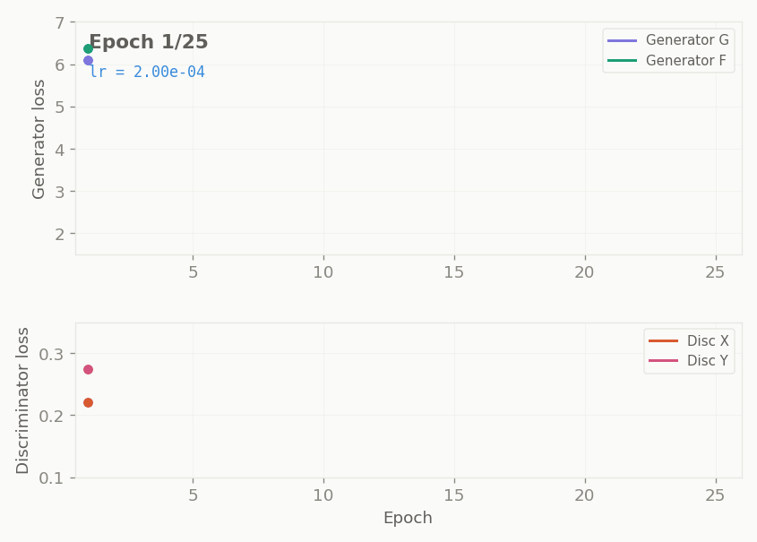

## Sample Results

| | | | |
|:---:|:---:|:---:|:---:|
| 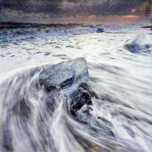 | 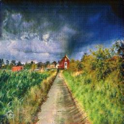 | 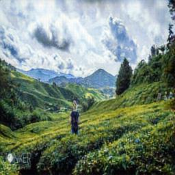 | 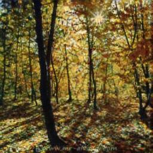 |
| 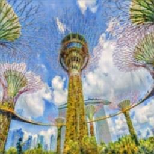 | 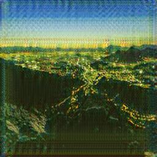 | 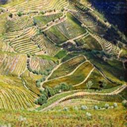 | 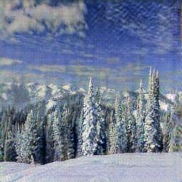 |
| 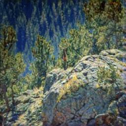 | 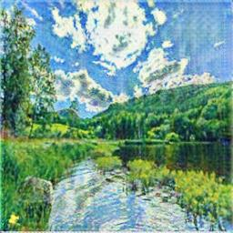 | 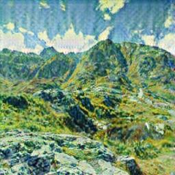 | 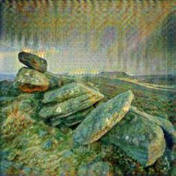 |

## Architecture

**Generator:** ResNet with 9 residual blocks (encoder-decoder with skip connections)
- 7x7 conv (64ch, stride 1) → 3x3 conv (128ch, ↓2) → 3x3 conv (256ch, ↓2) → 9 ResNet blocks → 2 deconv layers (↑2) → 7x7 conv (3ch) → tanh
- Instance Normalization throughout
- Learns "delta" updates rather than full reconstruction

**Discriminator:** Multi-scale PatchGAN
- Two parallel PatchGAN networks (full-resolution + half-resolution via average pooling)
- Each: Conv(64, ↓2) → Conv(128, ↓2) → Conv(256, ↓2) → Conv(512) → Conv(1) patch map
- Intermediate features (x1, x2, x3) used for feature matching loss

## Loss Functions

```
L_G = L_adv_full + L_adv_half         (LSGAN adversarial, both scales)
    + L_fm_full  + L_fm_half           (feature matching, w=10.0)
    + L_cyc                            (cycle consistency, λ=7.0)
    + L_id                             (identity, λ×0.1)
```

## Training Details

| Parameter | Value |
|---|---|
| Image size | 256×256 |
| Batch size | 4 |
| Epochs | 40 |
| Optimizer | Adam (lr=2e-4, β₁=0.5) |
| LR schedule | Constant 20 epochs, linear decay 20 epochs |
| Replay buffer | 50 images, 50% swap probability |
| Augmentation | Resize 286→crop 256, flip, brightness ±0.05, contrast/saturation ±5% |
| Hardware | Tesla P100 (16GB) |
| Training time | 4.5 hours |
| Framework | TensorFlow 2.19 |

## Key Implementation Choices

- **LSGAN** over binary cross-entropy for stable gradients
- **Instance Normalization** over Batch Normalization for per-image style independence
- **Multi-scale discriminator** for both fine texture and global coherence pressure
- **Feature matching loss** on intermediate discriminator layers (not just final output)
- **Image replay buffer** to prevent discriminator forgetting
- **Persistent gradient tape** for consistent updates across all four networks

## Run

The notebook runs as-is on Kaggle with GPU. It reads from the competition dataset:

```
/kaggle/input/gan-getting-started/monet_tfrec/*.tfrec
/kaggle/input/gan-getting-started/photo_tfrec/*.tfrec
```

Generates 7,000 Monet-style images and zips them for submission.

## Article

A detailed writeup covering the architecture, loss functions, training dynamics, and what the training logs actually mean is available on [Medium](YOUR_MEDIUM_LINK).

## References

1. Zhu et al. (2017). [Unpaired Image-to-Image Translation using Cycle-Consistent Adversarial Networks](https://arxiv.org/abs/1703.10593)
2. Mao et al. (2017). [Least Squares Generative Adversarial Networks](https://arxiv.org/abs/1611.04076)
3. Isola et al. (2017). [Image-to-Image Translation with Conditional Adversarial Networks](https://arxiv.org/abs/1611.07004)
4. Torbunov et al. (2023). [Rethinking CycleGAN: Improving Quality of GANs for Unpaired Image-to-Image Translation](https://arxiv.org/abs/2303.16280)

## License

MIT
